# Options Pricing, Volatility Surface & Volatility Trading — SPY

End-to-end Python project on equity index volatility, built on real SPY data:
pricing methods, the market's implied volatility surface, model calibration (SVI, Heston),
variance swaps, and the P&L of delta-hedged option positions over nearly 20 years.

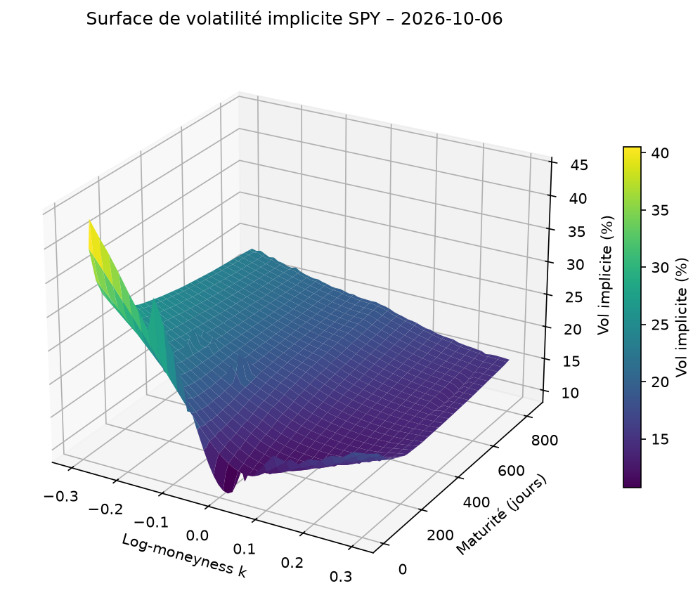

## Key results

- **Pricing:** closed form, Monte Carlo and a Crank-Nicolson PDE solver agree; second-order convergence of the PDE scheme confirmed, Richardson extrapolation brings the error to ~4·10⁻⁶.
- **Implied volatility surface:** built from 8,081 SPY option quotes with a custom implied-vol solver and implied forwards from put-call parity.
- **Calibration:** SVI fits each smile within 0.05–0.5 vol points; Heston fits the whole surface with 5 parameters (0.44 vol points RMSE, ρ = −0.64, Feller condition violated).
- **Variance swaps:** VIX reconstructed from SPY options at **14.93 vs 15.03** for the official index; Heston underprices the 1-year variance swap by ~2 vol points (no jumps).
- **Variance risk premium (2007–2026):** VIX averaged 20.0% vs 16.1% realised volatility; implied exceeded realised in 83% of months.
- **Backtest bias:** a naive delta-hedged straddle backtest shows a Sharpe ratio of 2.2; correcting for the gap between VIX and ATM implied volatility brings it down to 0.6.

## Contents

| Step | Topic | Notebook |
|---|---|---|
| 1 | European option pricing: closed form, Monte Carlo, finite differences | `01_pricer_validation` |
| 2 | SPY market data, implied volatility solver, smiles and surface | `00_snapshot`, `02_market_data` |
| 3 | SVI and Heston calibration, variance swap pricing, VIX reconstruction | `03_svi_calibration`, `04_heston`, `05_variance_swap` |
| 4 | Delta hedging: simulations, transaction costs, historical backtest | `06_delta_hedging`, `07_backtest` |
| 5 | Interactive Streamlit app | *in progress* |

---

## Step 1 — Pricing a European call three ways

Test case: S = 100, K = 100, T = 1, r = 5%, σ = 20%.

| Method | Price | Comment |
|---|---|---|
| Black-Scholes closed form | 10.4506 | Reference |
| Monte Carlo (1M paths) | 10.4532 ± 0.0289 (95% CI) | Error decreases as 1/√N |
| Crank-Nicolson PDE (400×400 grid) | 10.4481 | Second-order convergence |
| Crank-Nicolson + Richardson extrapolation | 10.45059 | Error ≈ 4·10⁻⁶ |

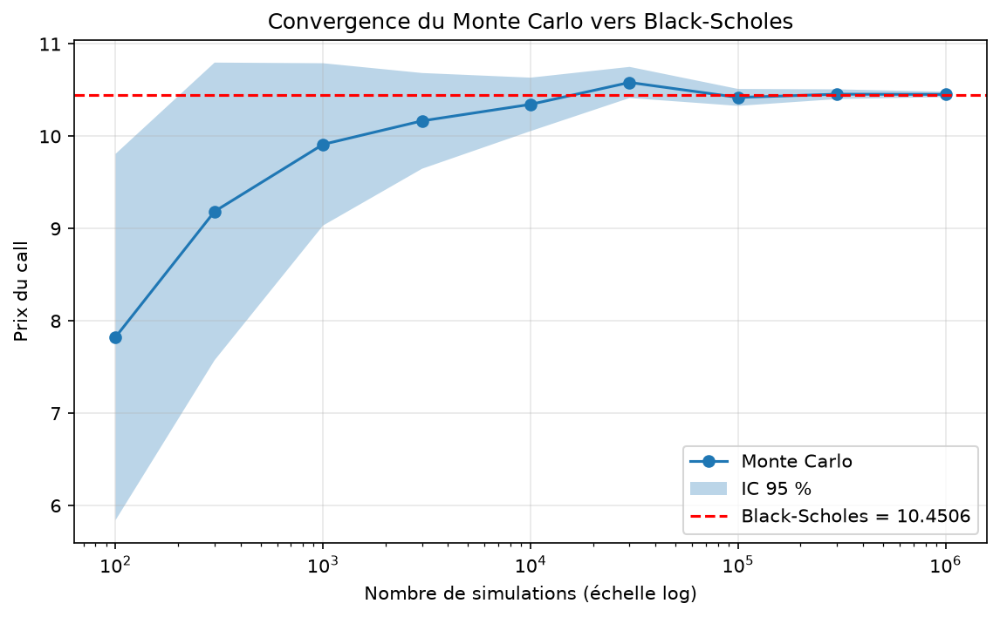

- Monte Carlo converges slowly: 100× more paths only divides the error by 10.
- Doubling the PDE grid divides the error by 4.00, confirming second-order convergence.
- In one dimension, finite differences are far more efficient than Monte Carlo;
  Monte Carlo becomes the method of choice for path-dependent or multi-asset products.

---

## Step 2 — SPY implied volatility surface

**Data:** full SPY option chain from `yfinance` (snapshot of 2026-10-06, spot = 779.88,
risk-free rate from the 13-week T-bill). 8,081 quotes after cleaning
(positive bid, maturity ≥ 7 days, relative bid-ask spread ≤ 50%), 26 maturities from 7 to 836 days.

**Methodology**
- **Implied forward from put-call parity** for each maturity, which gives the market-implied dividend yield.
- **Out-of-the-money options only:** most liquid, and negligible early-exercise premium,
  which limits the bias of applying European Black-Scholes to American SPY options.
- **Custom implied volatility solver:** Newton-Raphson on the analytical vega, Brent's method as fallback,
  no-arbitrage bounds checked first.

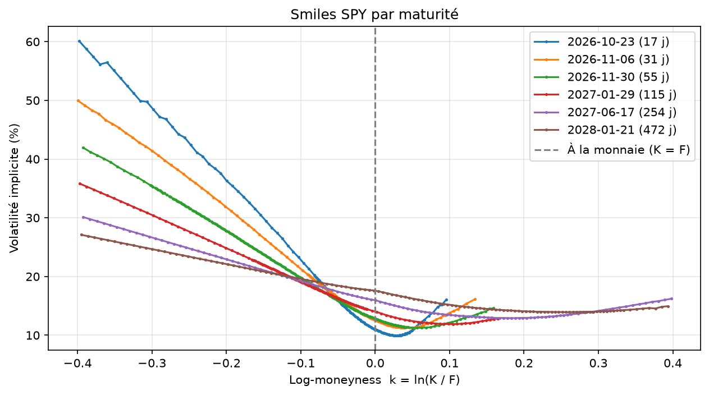

- **Pronounced skew:** at 17 days, implied vol goes from ~60% (k = −0.4) to ~10% at the money.
- **The skew flattens with maturity** and **ATM vol rises with maturity** (calm-market term structure).
- **The options "see" the dividend date:** the implied dividend yield is ~0 before SPY's December
  ex-dividend date and becomes positive afterwards.
- The smile is continuous across the put/call switch, whereas Yahoo's implied vols jump at the money.

---

## Step 3 — Modelling the surface

### SVI calibration

Raw SVI fitted maturity by maturity (least squares on implied vols, robust loss, multi-start).
Typical error: **0.05–0.5 vol points**.

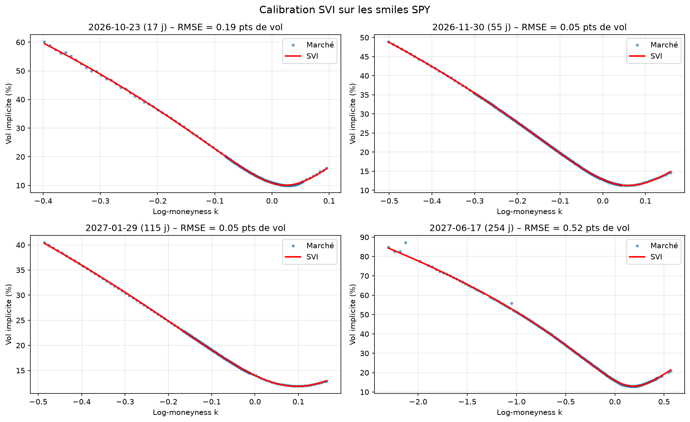

A first version constrained a ≥ 0: the parameter sat on its bound and the right wing was missed.
Allowing a < 0 (with non-negative minimum variance) fixed it. Lesson: always check whether
calibrated parameters hit their bounds.

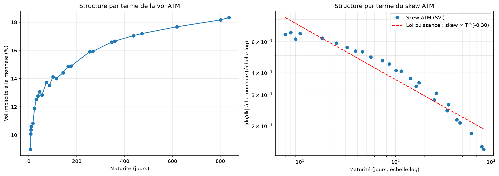

- ATM vol rises from 9% (1 week) to 18.3% (2.3 years).
- ATM skew decays roughly as **T^(−0.40)** for maturities ≥ 30 days. The flattening below
  3 weeks is partly a measurement artefact (the smile minimum sits close to k = 0).

### Heston calibration

Pricing via the characteristic function (Lewis formula), calibrated on the SVI-smoothed surface
(maturities ≥ 30 days, vega-weighted price errors).

| v₀ | κ | θ | ξ | ρ | RMSE |
|---|---|---|---|---|---|
| 0.0174 (13.2% vol) | 1.90 (half-life 0.37 y) | 0.0593 | 0.87 | −0.64 | 0.44 vol pts |

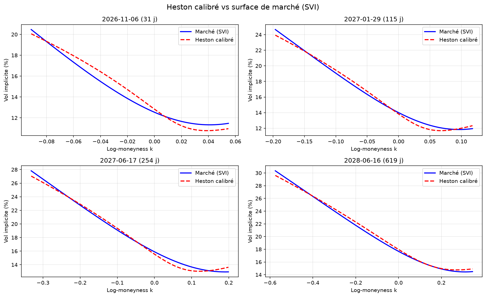

- Heston captures the overall shape with 5 parameters, but **systematically underprices deep OTM puts**
  (0.5–1 vol point) and fits the shortest maturities worst: a pure diffusion cannot produce enough
  short-term skew without jumps.
- The **Feller condition is violated** (2κθ = 0.22 < ξ² = 0.76), as is typical for index calibrations:
  the variance can reach zero, which requires care (e.g. full truncation) in Monte Carlo simulation.

### Variance swaps and VIX reconstruction

Fair variance strike by static replication on the SVI smiles,
K_var = (2/T) ∫ õ(k) e^(−k) dk, validated on a flat-volatility case.

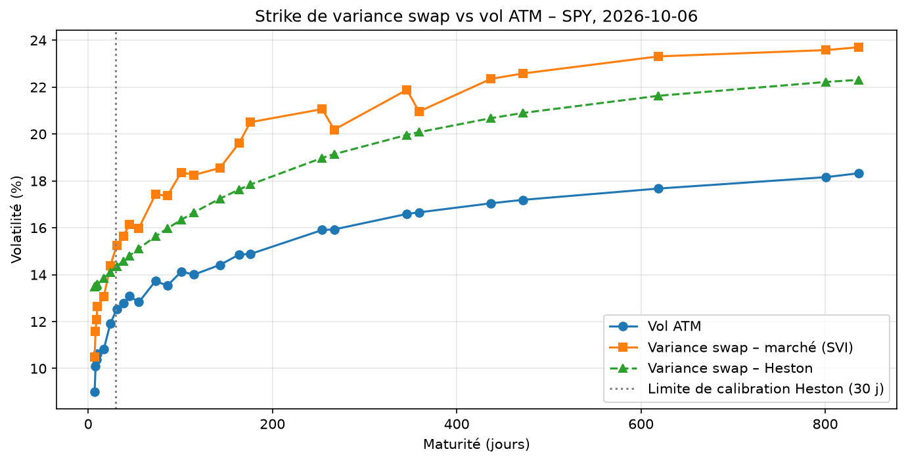

- The variance swap strike is always above ATM vol: the **skew premium** grows from ~1.5 vol points
  at 1 week to ~5.4 at 2 years (1-year: 21.9% vs 16.6% ATM).
- **Heston underprices variance swaps by 1.5–2 vol points** beyond 30 days, a direct consequence
  of its too-thin put wing: a concrete measure of model risk.
- **Wing sensitivity:** extrapolated vs truncated strikes differ by 0.1–0.3 vol points on standard
  monthly expiries, but by up to ~2.5 points on end-of-month expiries with sparse far strikes.
- **VIX reconstructed** with the official interpolation to 30 days: **14.93 vs 15.03**.

---

## Step 4 — Delta hedging and the variance risk premium

### Simulations

Short ATM 1-month call sold at 20% implied vol, delta-hedged.

| Hedging | Std of P&L | Std / premium |
|---|---|---|
| Weekly | 0.93 | 38% |
| Daily | 0.43 | 17% |
| 4× per day | 0.22 | 9% |
| ~Hourly | 0.11 | 4% |

- Hedging error decreases as 1/√N; even with a perfect model, daily hedging leaves 17% of the premium at risk.
- The P&L depends on realised vs implied vol (≈ vega × vol difference), not on the drift of the stock.
- Path by path, the hedging P&L matches **½·Γ·S²·(σ²_implied − realised²)**: a gamma-weighted bet on volatility.

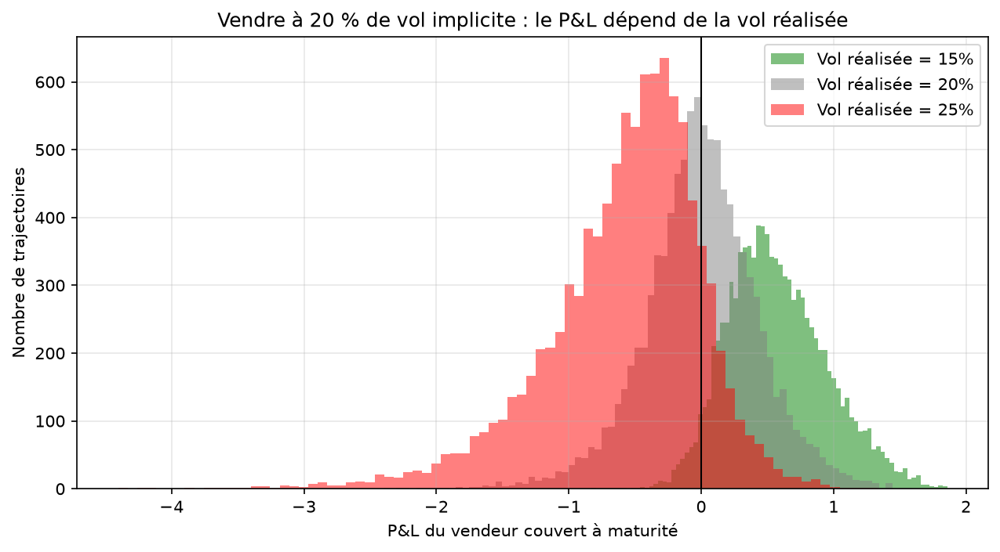
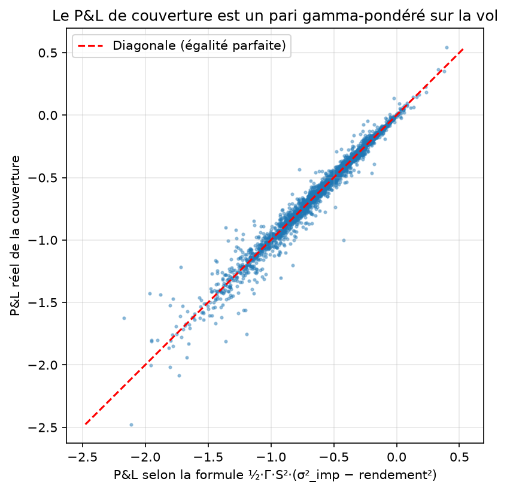
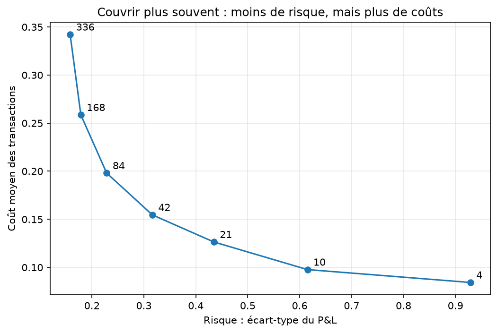

With 5 bp transaction costs, costs grow as √N while risk falls as 1/√N (Leland): beyond
1–2 rebalances per day, extra hedging adds cost for little risk reduction.

### Historical backtest (2007–2026)

Each month, sell 1-month volatility at the VIX level: a variance swap, and an ATM straddle
delta-hedged daily on real SPY prices.

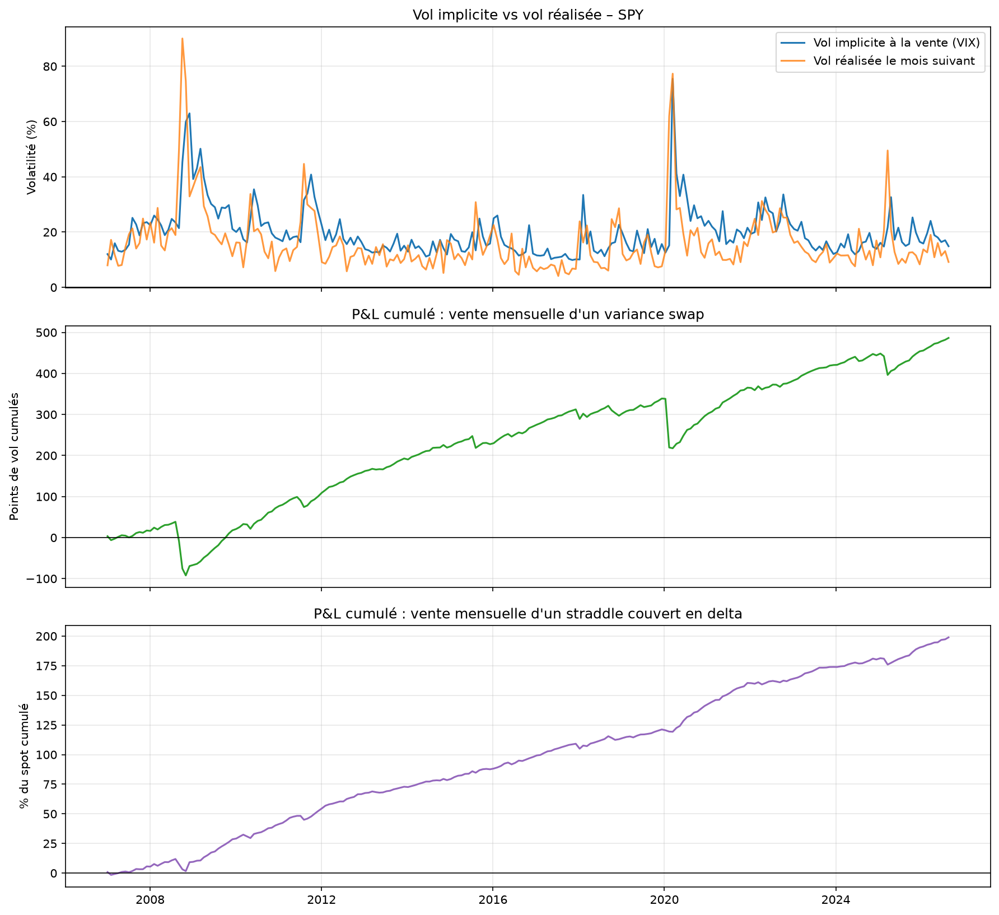

- **Variance risk premium:** VIX 20.0% on average vs 16.1% realised; implied > realised in 83% of months.
- **Variance swap seller:** median +3.95 vol points per month but mean +2.06, with fat left tail:
  −118.7 points in February 2020 (sold at 15.2%, realised 61.9%).
- **Straddle vs variance swap:** in February 2020 the straddle lost only 1.1% of spot: the market moved
  away from the strike, where gamma is small. The straddle's P&L is gamma-weighted; the variance swap's is not.

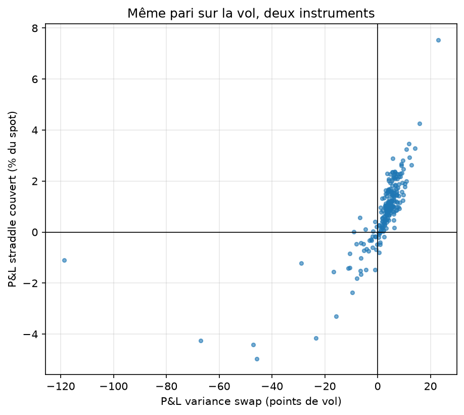

**Robustness check.** An ATM straddle trades at ATM implied vol, below the VIX (~2.7 points at 30 days
in step 3). Selling at the VIX overstates the premium:

| Straddle sold at | Mean P&L (% spot / month) | Winning months | Annualised Sharpe |
|---|---|---|---|
| VIX | 0.84 | 82% | 2.18 |
| VIX − 1 pt | 0.61 | 76% | 1.60 |
| VIX − 2 pts | 0.38 | 72% | 1.01 |
| **VIX − 2.7 pts (realistic)** | **0.22** | **68%** | **0.58** |
| VIX − 3 pts | 0.15 | 65% | 0.40 |

The variance risk premium survives, but it is much smaller than a naive backtest suggests,
before transaction costs and with a fat left tail that the Sharpe ratio does not capture.

---

## Limitations

- Single market snapshot for the surface; the VIX–ATM gap was measured on one (calm) day.
- VIX is computed on the S&P 500, not on SPY; SPY options are American.
- No option bid-ask or hedging costs in the historical backtest.
- Yahoo Finance data, ~15 minutes delayed; the official VIX value was retrieved intraday.

## Reproducibility

Market data are stored as dated snapshots in `data/`. The snapshot used by every notebook is set
in one place, `src/config.py`. To use new data: run `00_snapshot` during US market hours,
update `SNAPSHOT_DATE`, then run notebooks 02 → 07 in order.

## Project structure

```
├── data/          # Dated market snapshots and history (CSV)
├── figures/       # Charts used in this README
├── notebooks/     # 00_snapshot → 07_backtest
└── src/
    ├── config.py              # Snapshot date and paths
    ├── data.py                # Market data download, snapshots, history
    ├── black_scholes.py       # Closed-form prices and Greeks
    ├── monte_carlo.py         # Monte Carlo pricer
    ├── finite_differences.py  # Crank-Nicolson PDE solver
    ├── implied_vol.py         # Implied volatility solver
    ├── vol_surface.py         # Implied forwards and smiles
    ├── svi.py                 # SVI calibration
    ├── heston.py              # Heston pricing (Fourier) and calibration
    ├── variance_swap.py       # Variance swap replication
    ├── hedging.py             # Delta-hedging simulation
    └── backtest.py            # Historical volatility-selling backtest
```

## How to run

```bash
python -m venv .venv
.venv\Scripts\activate        # Windows  (macOS/Linux: source .venv/bin/activate)
pip install -r requirements.txt
```
Then run the notebooks in order.

---

*Aymeric Riousse — MSc Quantitative Finance, ECE Paris ·
[LinkedIn](https://www.linkedin.com/in/aymericriousse/)*